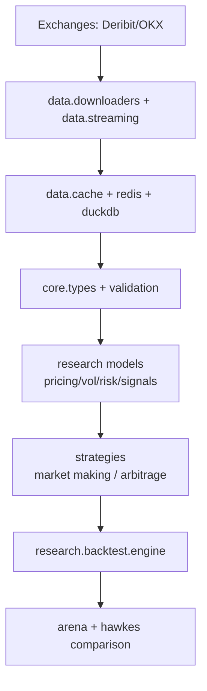

# CORP - Crypto Options Research Platform

[](https://www.python.org/downloads/)
[](https://github.com/signorloops/crypto-options-research-platform/actions/workflows/ci.yml)
[](https://github.com/psf/black)
[](https://opensource.org/licenses/MIT)

加密货币期权研究与回测平台（专注币本位期权 / COIN-margined options）。

支持 Deribit/OKX 数据接入、实时流式处理、定价与波动率建模、做市/套利策略、风险控制与事件驱动回测。

## 核心能力

- 币本位定价与 Greeks
  - Inverse option 定价、隐含波动率反解、Put-Call parity 校验
- 波动率研究
  - 历史波动率（RV/Parkinson/GK/RS/YZ）、EWMA/GARCH/HAR、IV 曲面与 SVI
- 风险管理
  - Greeks 聚合、VaR/CVaR（Parametric/Historical/FHS/EVT/MC）、4级 Circuit Breaker
- 策略体系
  - 做市：Naive、Avellaneda-Stoikov、Hawkes、Integrated、FastIntegrated、XGBoost、PPO
  - 套利：跨交易所、期现基差、转换/反转、盒式套利
- 回测与评测
  - 事件驱动回测引擎、现实成交摩擦模拟、Strategy Arena、Hawkes 专项对比框架
- 数据与工程
  - Parquet + DuckDB + Redis 多层缓存，WebSocket 自动重连，健康检查与研究看板
- 长期研究模块
  - Rough Volatility、Online BOCD、Deep Hedging、Almgren-Chriss 最优执行

## 快速开始

### 安装

```bash
# 克隆仓库
git clone https://github.com/signorloops/crypto-options-research-platform.git
cd crypto-options-research-platform

# 创建并激活虚拟环境
python -m venv venv
source venv/bin/activate  # macOS/Linux
# 或 venv\Scripts\activate  # Windows

# 安装依赖
pip install -e ".[dev]"

# 可选：环境变量
cp .env.example .env
```

### 最小示例

```python
import numpy as np
from research.volatility.historical import realized_volatility
from research.pricing.inverse_options import InverseOptionPricer

# 1) 历史波动率
returns = np.random.normal(0, 0.02, 500)
vol = realized_volatility(returns, annualize=True, periods=365)

# 2) 币本位看涨定价
price = InverseOptionPricer.calculate_price(
    S=50000, K=52000, T=30/365, r=0.03, sigma=vol, option_type="call"
)
print(f"RV={vol:.2%}, Inverse Call={price:.8f} BTC")
```

## 架构总览



## 项目结构

```text
corp/
├── core/                    # 类型系统、异常、验证、健康服务
├── data/                    # 下载器、缓存、流式、重建
├── research/
│   ├── pricing/             # inverse 定价、rough volatility
│   ├── volatility/          # 历史/条件/隐含波动率模型
│   ├── risk/                # Greeks、VaR、Circuit Breaker
│   ├── signals/             # HMM regime、fast regime、BOCD
│   ├── hedging/             # adaptive delta、deep hedging
│   ├── execution/           # Almgren-Chriss
│   └── backtest/            # 回测引擎、策略竞技场、Hawkes专项评测
├── strategies/
│   ├── market_making/       # 多做市策略
│   └── arbitrage/           # 多套利策略
├── execution/               # 容器入口与研究看板
├── docs/                    # 文档
└── tests/                   # 测试
```

## 文档导航

新用户优先：

- [完全指南](docs/GUIDE.md)
- [项目全景图（Mermaid）](docs/project-map-mermaid.md)
- [快速开始](docs/quickstart.md)
- [架构文档](docs/architecture.md)
- [理论手册](docs/theory.md)
- [API 文档](docs/api.md)

算法学习：

- [算法与模型深度讲解](docs/算法与模型深度讲解.md)
- [算法与模型入门学习版](docs/算法与模型入门学习版.md)

专项文档：

- [Hawkes 策略对比实验](docs/hawkes_comparison_experiment.md)
- [缓存策略](docs/cache_strategy.md)
- [研究看板](docs/dashboard.md)
- [部署指南](docs/deployment.md)
- [2026 Q2 长期执行路线图](docs/plans/2026-Q2-long-term-execution-roadmap.md)
- [每周执行清单模板](docs/plans/weekly-operating-checklist.md)

## 常用命令

```bash
# 全量测试
pytest -q -m "not integration"

# 显式运行集成测试（访问交易所 API）
RUN_INTEGRATION_TESTS=1 pytest -q -m "integration"

# 覆盖率
pytest tests/ --cov=core --cov=data --cov=research --cov=strategies

# 代码质量
black .
ruff check . --fix
mypy .
```

## 研究看板

```bash
uvicorn execution.research_dashboard:app --host 0.0.0.0 --port 8501
```

打开 `http://localhost:8501` 查看回测结果与统计。

## 贡献

1. 创建分支
2. 开发与测试
3. 提交 PR

建议在提交前至少运行 `pytest -q -m "not integration"`。

## 许可证

MIT License，见 [LICENSE](LICENSE)。

## 致谢

- [Deribit API](https://docs.deribit.com/)
- [OKX API](https://www.okx.com/docs-v5/en/)
- [Pydantic](https://docs.pydantic.dev/)
- [pytest](https://docs.pytest.org/)
