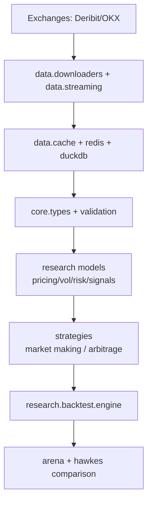

# CORP - Crypto Options Research Platform

[English](README.md) | [简体中文](README.zh-CN.md)

[](https://www.python.org/downloads/)
[](https://github.com/signorloops/crypto-options-research-platform/actions/workflows/ci.yml)
[](https://github.com/psf/black)
[](https://opensource.org/licenses/MIT)

A release-candidate-track crypto options research and backtesting platform focused on coin-margined options (COIN-margined options).

Supports Deribit/OKX data ingestion, real-time streaming, pricing and volatility modeling, market-making/arbitrage strategies, risk control, and event-driven backtesting.

## Core Capabilities

- Coin-margined pricing and Greeks
  - Inverse option pricing, implied volatility inversion, Put-Call parity checks
- Volatility research
  - Historical volatility (RV/Parkinson/GK/RS/YZ), EWMA/GARCH/HAR, IV surface and SVI
- Risk management
  - Greeks aggregation, VaR/CVaR (Parametric/Historical/FHS/EVT/MC), 4-level Circuit Breaker
- Strategy framework
  - Market making: Naive, Avellaneda-Stoikov, Hawkes, Integrated, FastIntegrated, XGBoost, PPO
  - Arbitrage: cross-exchange, spot-futures basis, conversion/reversal, box spread arbitrage
- Backtesting and evaluation
  - Event-driven backtest engine, realistic execution-friction simulation, Strategy Arena, Hawkes comparison framework
- Data and engineering
  - Parquet + DuckDB + Redis multi-layer cache, WebSocket auto-reconnect, health checks, and research dashboard
- Long-horizon research modules
  - Rough Volatility, Jump Premia, Almgren-Chriss optimal execution

## Quick Start

### Installation

```bash
# Clone repository
git clone https://github.com/signorloops/crypto-options-research-platform.git
cd crypto-options-research-platform

# Create and activate virtual environment
python -m venv venv
source venv/bin/activate  # macOS/Linux
# or venv\Scripts\activate  # Windows

# Install dependencies (default lightweight dev stack)
pip install -e ".[dev]"

# Optional: full stack (ML + Notebook + accelerators)
pip install -e ".[dev,full]"

# Optional: environment variables
cp .env.example .env
```

### Minimal Example

```python
import numpy as np
from research.volatility.historical import realized_volatility
from research.pricing.inverse_options import InverseOptionPricer

# 1) Historical volatility
returns = np.random.normal(0, 0.02, 500)
vol = realized_volatility(returns, annualize=True, periods=365)

# 2) Coin-margined call pricing
price = InverseOptionPricer.calculate_price(
    S=50000, K=52000, T=30/365, r=0.03, sigma=vol, option_type="call"
)
print(f"RV={vol:.2%}, Inverse Call={price:.8f} BTC")
```

## Architecture Overview


```mermaid
graph TD
    A["Exchanges: Deribit/OKX"] --> B["data.downloaders + data.streaming"]
    B --> C["data.cache + redis + duckdb"]
    C --> D["core.types + validation"]
    D --> E["research models<br/>pricing/vol/risk/signals"]
    E --> F["strategies<br/>market making / arbitrage"]
    F --> G["research.backtest.engine"]
    G --> H["arena + hawkes comparison"]
```

## Project Structure

```text
corp/
├── core/                    # Type system, exceptions, validation, health services
├── data/                    # Downloaders, cache, streaming, reconstruction
├── research/
│   ├── pricing/             # Inverse pricing, rough volatility
│   ├── volatility/          # Historical/conditional/implied volatility models
│   ├── risk/                # Greeks, VaR, Circuit Breaker
│   ├── signals/             # HMM regime, fast regime, jump premia
│   ├── hedging/             # Adaptive delta, quanto inverse hedging
│   ├── execution/           # Almgren-Chriss
│   └── backtest/            # Backtest engine, strategy arena, Hawkes evaluation
├── strategies/
│   ├── market_making/       # Market-making strategies
│   └── arbitrage/           # Arbitrage strategies
├── execution/               # Container entrypoints and research dashboard
├── docs/                    # Documentation
└── tests/                   # Tests
```

## Documentation

Documentation follows an index-first pattern to avoid maintaining duplicate descriptions across files.

- [Weekly operating checklist](docs/plans/weekly-operating-checklist.md)
- [Algorithm freeze checklist](docs/plans/algorithm-freeze-checklist.md)
- [Q1 historical archive summary](docs/archive/2026-Q1-archive-summary.md)

Common topics:

- [Architecture documentation](docs/architecture.md)
- [Theory handbook](docs/theory.md)
- [Deployment guide](docs/deployment.md)

## Common Commands

```bash
# Full test suite (excluding integration)
pytest -q -m "not integration"

# Explicit integration tests (requires exchange APIs)
RUN_INTEGRATION_TESTS=1 pytest -q -m "integration"

# Coverage
pytest tests/ --cov=core --cov=data --cov=research --cov=strategies

# Code quality
black .
ruff check . --fix
mypy .

# Workspace slimming (review plan, then execute)
make workspace-slim-report
make workspace-slim-clean

# Complexity governance (strict/regression compare)
make complexity-audit
make complexity-audit-refresh-baseline
make complexity-audit-regression
make algorithm-performance-baseline
make latency-benchmark
make prepare-rollback-tag
make algorithm-freeze-check

# Weekly governance pipeline and pre-release hard gates
# (weekly-operating-audit runs and enforces both algorithm-performance-baseline and latency-benchmark)
# (prepare-rollback-tag creates or reuses a local rollback tag before canary / signoff review)
# (weekly-manual-prefill writes both artifacts/weekly-manual-status.json and artifacts/weekly-manual-status.md)
make weekly-operating-audit
make weekly-close-gate

# Explicitly confirm manual items / sign-offs after review
make weekly-manual-update MANUAL_ARGS='--check gray_release_completed=true --signoff research=alice --signoff engineering=bob'

# Production deviation snapshot
# (defaults use repository fixtures; override LIVE_CEX_FILE / LIVE_DEFI_FILE for external data)
make live-deviation-snapshot

# Check deployment config for legacy entrypoint names
make check-service-entrypoint

# Validate branch names against optional configured keywords
make branch-name-guard
```

## Circuit Breaker Alerts

Circuit breaker state degradation (`NORMAL -> WARNING/RESTRICTED/HALTED`) can trigger webhook alerts.

- Enable/disable: `CB_ALERT_ENABLED=true|false`
- Generic webhook: `CB_ALERT_WEBHOOK_URL` (fallback alias: `ALERT_WEBHOOK_URL`)
- Slack incoming webhook: `CB_SLACK_WEBHOOK_URL`
- Request timeout (seconds): `CB_ALERT_TIMEOUT_SECONDS` (default `5`)

Webhook payload includes `severity`, `state`, `violation_count`, top `violations`, and UTC `timestamp`.
Slack payload sends a human-readable summary with top violations.

## Research Dashboard

```bash
uvicorn execution.research_dashboard:app --host 0.0.0.0 --port 8501
```

Open `http://localhost:8501` to inspect backtesting results and metrics.

## Contributing

1. Create a branch
2. Develop and test
3. Open a PR

Before opening a PR, run at least `pytest -q -m "not integration"`.

## License

MIT License. See [LICENSE](LICENSE).

## Acknowledgements

- [Deribit API](https://docs.deribit.com/)
- [OKX API](https://www.okx.com/docs-v5/en/)
- [Pydantic](https://docs.pydantic.dev/)
- [pytest](https://docs.pytest.org/)
