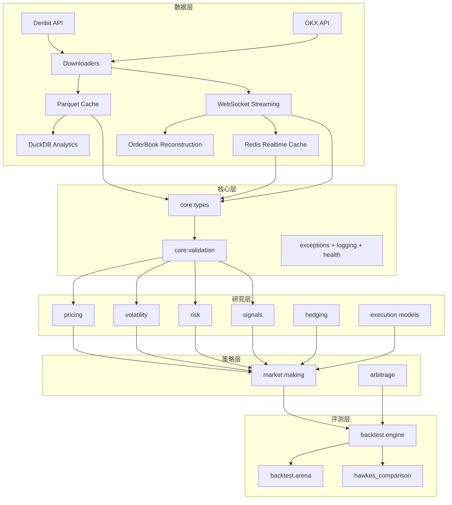

# CORP 架构文档

## 系统概览

CORP (Crypto Options Research Platform) 是一个以 **币本位期权研究** 为核心的分层系统，覆盖：

1. 多交易所数据接入（Deribit / OKX）
2. 多层缓存（Parquet / Redis / DuckDB）
3. 研究模型（定价、波动率、风险、状态检测）
4. 策略执行（做市、套利、对冲）
5. 事件驱动回测与策略横向评测

## 总体架构



## 模块结构

### 1. 数据层

```text
data/
├── downloaders/
│   ├── deribit.py
│   └── okx.py
├── cache.py
├── cache_policy.py
├── duckdb_cache.py
├── redis_cache.py
├── integrated_manager.py
├── streaming.py
└── orderbook_reconstructor.py
```

关键职责：

- REST 历史数据下载
- WebSocket 实时流消费
- 本地落盘与按时间分区
- 实时缓存 TTL 策略
- 订单簿增量重建与 gap 检测

### 2. 核心层

```text
core/
├── types.py
├── exceptions.py
├── health_server.py
└── validation/
    ├── schemas.py
    └── validators.py
```

关键职责：

- 统一数据契约（`MarketState`, `Position`, `QuoteAction`）
- 输入/配置校验
- 运行时错误边界与健康探针

### 3. 研究层

```text
research/
├── pricing/       # inverse pricing + rough volatility
├── volatility/    # historical/EWMA/GARCH/HAR/IV surface
├── risk/          # greeks + var + circuit breaker
├── signals/       # HMM regime + fast regime + BOCD
├── hedging/       # adaptive delta + deep hedging
├── execution/     # Almgren-Chriss
└── backtest/      # engine + arena + hawkes comparison
```

### 4. 策略层

```text
strategies/
├── market_making/
│   ├── naive.py
│   ├── avellaneda_stoikov.py
│   ├── hawkes_mm.py
│   ├── integrated_strategy.py
│   ├── fast_integrated_strategy.py
│   ├── xgboost_spread.py
│   └── ppo_agent.py
└── arbitrage/
    ├── cross_exchange.py
    ├── basis.py
    ├── conversion.py
    └── option_box.py
```

## 关键调用链

### 做市回测调用链

```text
BacktestEngine.run()
  -> strategy.quote(MarketState, Position)
  -> RealisticFillSimulator.simulate_fill(...)
  -> BacktestEngine._process_fill(...)
  -> strategy.on_fill(...)
  -> BacktestEngine._compute_result()
```

### 综合策略调用链

```text
IntegratedMarketMakingStrategy.quote()
  -> circuit_breaker.check_risk_limits(...)
  -> regime_detector.update(...)
  -> hedger.should_hedge(...)
  -> reservation_price + spread + size
  -> QuoteAction
```

### 波动率曲面链路

```text
VolatilitySurface.add_from_market_data(...)
  -> implied_volatility(...)
  -> fit_svi()/fit_all_svi()/fit_ssvi()
  -> validate_no_arbitrage()
```

## 2026-02 架构增量

### A. Backtest Fill Pipeline（conditional fill probability）

`research/backtest/engine.py` 的成交模拟路径新增条件概率层：

```text
simulate_fill(...)
  -> _estimate_fill_probability(queue/competitiveness/latency/imbalance/vol)
  -> _create_fill(...)
```

该层让 fill probability 对盘口状态动态响应，而不是固定常数。

### B. Regime Detector（sticky gating）

`research/signals/regime_detector.py` 在 HMM 输出后新增 sticky 门控：

```text
HMM posterior
  -> variance/covariance based state map
  -> persistence + confidence + hysteresis gate
  -> current regime
```

### C. Strategy Calibration Loop（online calibration）

在线校准在两个策略内形成统一回路：

```text
market state
  -> rolling returns + trade intensity + inventory utilization
  -> calibrated parameters
  -> quote metadata (calibrated_sigma / calibrated_k / calibrated_inventory_skew_factor)
```

对应文件：
- `strategies/market_making/avellaneda_stoikov.py`
- `strategies/market_making/integrated_strategy.py`

### D. Risk Engine（full revaluation）

`research/risk/var.py` 的 Monte Carlo 分支升级：

```text
if option contract fields available:
  full revaluation via InverseOptionPricer
else:
  greeks approximation / linear path
```

该设计保留原有接口，同时增强期权头寸的大冲击场景精度。

### E. Vol Surface Engine（ssvi mode）

`research/volatility/implied.py` 的 `VolatilitySurface` 新增 `method="ssvi"`：
- 全局 `rho/eta/lambda` 参数缓存
- ATM total variance term structure 单调化
- 用于跨期限一致的 surface 查询

### F. Hawkes Control Plane（marked + MLE）

该层对应 marked hawkes 扩展。

`strategies/market_making/hawkes_mm.py` 增加：
- marked 事件输入（trade size）
- online MLE 参数更新接口（`estimate_parameters_online(use_mle=True)`）
- quote `control_signals` 元数据输出（intensity、flow_imbalance、spread/skew 控制量）

## 运维补充（缓存与看板）

1. 缓存分层：
- Parquet（历史持久化）
- DuckDB（分析查询层）
- Redis（低延迟实时值）

2. 缓存策略：
- Redis TTL 集中在 `data/cache_policy.py`
- 通过 `IntegratedDataManager.invalidate_realtime_cache(...)` 做定向失效
- 读路径为最终一致性，历史回放以 Parquet 为准

3. 研究看板：
- 启动：`python -m execution.research_dashboard`
- 默认端口：`8501`（可用环境变量覆盖）
- 提供 UI、文件列表、偏离分析、健康检查等接口
- 支持 `make live-deviation-snapshot` 生成偏离快照产物

## 设计原则

1. **研究与生产兼容**
   策略逻辑可直接在回测与服务运行中复用。

2. **数据与模型解耦**
   下载/缓存不绑定具体模型，模型层按统一类型消费数据。

3. **风险优先**
   Circuit Breaker 在策略层前置，限制仓位与交易动作。

4. **可扩展实验框架**
   新模型可通过 `MarketMakingStrategy` 接口纳入同一评测体系。

## 相关文档

- `docs/theory.md`
- `docs/api.md`
- `docs/hawkes_comparison_experiment.md`
