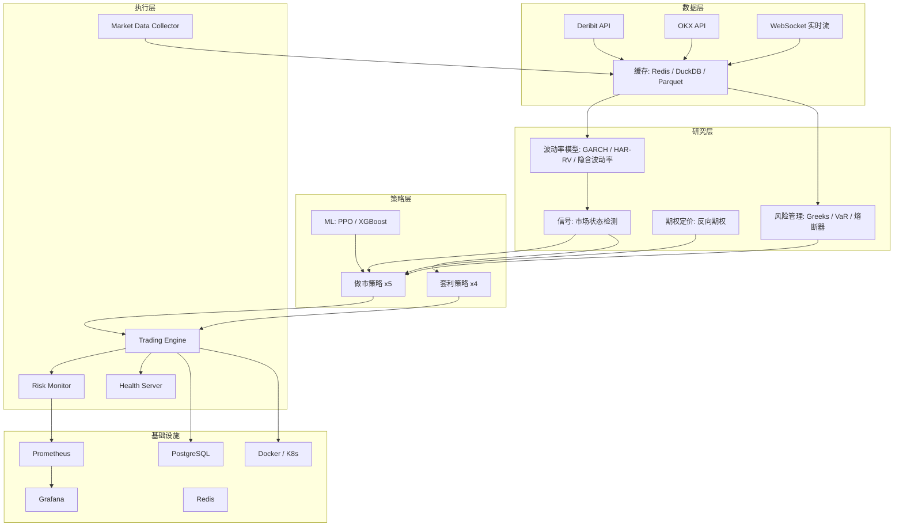

# CORP 项目审查报告与优化计划

## 项目概览

CORP 是一个基于 Python 的加密货币期权研究与交易平台，聚焦于 coin-margined 期权（Deribit / OKX），包含数据采集、波动率建模、交易策略、回测引擎和生产执行服务。

## 项目评分: B+ (良好，有改进空间)

### 做得好的地方

- **架构设计清晰**: 数据层 / 研究层 / 策略层 / 执行层分层合理
- **类型安全**: MyPy 严格模式 + Pydantic v2 数据校验
- **代码规范**: Black + Ruff + Pre-commit hooks 完整配置
- **自定义异常体系**: `CORPError` -> `ValidationError`, `PricingError`, `APIError` 等
- **异步架构**: asyncio + aiohttp + WebSocket 全栈异步
- **多层缓存**: Redis (热数据) / DuckDB (分析) / Parquet (持久化)
- **测试覆盖**: ~220 个测试，72% 覆盖率，含异步测试
- **容器化部署**: 多阶段 Docker 构建 + K8s HPA/PDB + 非 root 运行
- **CI/CD**: GitHub Actions 含 lint / type check / test / security scan
- **监控基础**: Prometheus + Grafana + 健康检查端点

---

## 需要优化的地方

### P0 - 关键问题 (建议立即修复)

**1. 依赖版本不一致**

- `requirements.txt` 与 `pyproject.toml` 存在版本冲突:
  - scipy: `>=1.11.0` vs `>=1.10.0`
  - websockets: `>=12.0` vs `>=11.0`
- 建议: 统一以 `pyproject.toml` 为唯一依赖源，用 `pip install -e .` 替代 `requirements.txt`

**2. Prometheus 指标格式错误**

- [corp/core/health_server.py](corp/core/health_server.py) 的 `/metrics` 返回 JSON，不是 Prometheus 格式
- 且 `prometheus_client` 库未在依赖中
- 建议: 引入 `prometheus_client`，使用标准 Prometheus 格式暴露指标

**3. 服务端口冲突**

- `trading_engine`, `risk_monitor`, `market_data_collector` 三个服务默认端口都是 8080
- 单机运行会冲突
- 建议: 分配不同默认端口 (8080/8081/8082)

**4. 健康检查是占位符**

- 当前健康检查为 `lambda: True`，没有真正检查数据库/Redis 连接
- 建议: 实现真实的数据库连通性检查、内存使用检查

### P1 - 高优先级 (近期改进)

**5. 测试覆盖率不足**

- 当前 72%，CI 阈值仅 75%
- 建议: 提升至 80%+，重点补充:
  - 执行层服务的集成测试
  - 异常路径测试
  - 缓存失效场景测试

**6. 缺少 Web 用户界面**

- 目前只能通过 CLI 和 Jupyter Notebook 交互
- 建议: 考虑用 **Streamlit** 或 **Gradio** 快速搭建研究界面，或用 **Next.js + FastAPI** 构建完整 Dashboard

**7. Plotly 未被利用**

- 已在依赖中但几乎没使用，所有图表都是静态 matplotlib
- 建议: 将回测结果和波动率曲面用 Plotly 做交互式可视化

**8. 缺少 `.dockerignore`**

- 可能将 venv / .git / notebooks 等无关文件打入镜像
- 建议: 添加 `.dockerignore` 排除不必要文件

**9. K8s 配置不完整**

- 只有 `trading-engine` 的 Deployment，缺少:
  - `risk-monitor` 和 `market-data-collector` 的 Deployment
  - Secret manifest (`mm-secrets` 被引用但未定义)
  - Ingress 配置
- 建议: 补全所有服务的 K8s 清单

**10. 缺少 CD 自动部署**

- CI 只做构建和测试，没有自动部署到 staging/production
- Docker 镜像没有推送到 registry
- 建议: 添加 CD pipeline，含镜像推送和滚动部署

### P2 - 中优先级 (持续改进)

**11. 魔法数字散布**

- 代码中存在硬编码值如 `await asyncio.sleep(0.1)`, `limit=1000`
- 建议: 提取到配置文件或常量定义

**12. 中英文注释混杂**

- 部分模块用中文注释，部分用英文
- 建议: 统一为英文注释（开源友好），中文可保留在文档中

**13. 缓存失效策略不明确**

- Redis / DuckDB / Parquet 三层缓存，但没有清晰的失效/淘汰策略
- 建议: 定义 TTL 策略和缓存一致性机制

**14. 异步竞态条件风险**

- 多个异步操作访问共享状态（如 Position），无明确锁机制
- 建议: 对关键状态操作加 `asyncio.Lock`

**15. 大文件需拆分**

- `circuit_breaker.py`, `hawkes_comparison.py` 等文件过大
- 建议: 按职责拆分为更小的模块

### P3 - 低优先级 (锦上添花)

**16. 缺少分布式追踪**

- 没有 OpenTelemetry / Jaeger 集成
- 多服务架构下调试困难

**17. 缺少日志聚合**

- 没有 ELK / Loki 等日志收集方案

**18. Prometheus 告警规则被注释**

- `deployment/config/prometheus.yml` 中告警规则未启用

**19. 性能基准测试**

- CI 引用了 `latency_benchmark.py` 但需确认文件是否存在且可用

---

## 建议实施路线图

**第一阶段 (1-2 天)**: P0 关键修复

- 统一依赖管理
- 修复端口冲突
- 实现真实健康检查
- 添加 `.dockerignore`

**第二阶段 (1 周)**: P1 核心改进

- 提升测试覆盖率
- 修复 Prometheus 指标格式
- 补全 K8s 配置
- 添加 CD pipeline

**第三阶段 (2-4 周)**: P2 持续优化

- 搭建 Web Dashboard (Streamlit/Gradio)
- 统一注释语言
- 提取魔法数字
- 完善缓存策略
- 处理异步竞态

**第四阶段 (按需)**: P3 锦上添花

- 分布式追踪
- 日志聚合
- 告警规则
