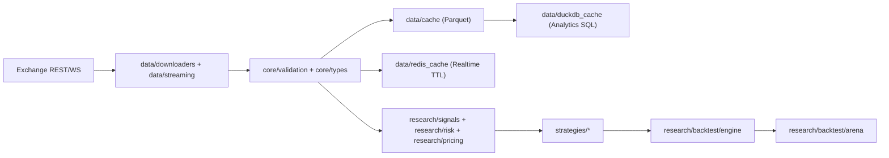

# CORP 项目深度学习手册（第二册）
> 主题：逐文件调用链深度导读（函数级）  
> 代码库：`<项目根目录>/corp`  
> 目标：把“知道模块名”升级为“能沿调用链定位问题、扩展功能、解释数学与工程权衡”

---

## 0. 如何使用本册

本册不是 API 字典，而是“函数级执行地图”。阅读建议：
1. 先读第 1 章全局调用拓扑，建立系统时空感。
2. 再按第 2 章逐目录逐文件走调用链，边看代码边画图。
3. 每个文件都按三条主线看：
- 数学：公式、量纲、边界条件、数值稳定性。
- 算法：状态机、优化目标、复杂度、近似与退化路径。
- 工程：容错、并发、缓存、可观测性、可测试性。

关键记号：
- `A -> B -> C`：函数调用链。
- `入口函数`：外部最常触发的函数。
- `热路径`：被高频调用、延迟敏感的路径。
- `风险断点`：最可能出现数学误差或工程故障的节点。

---

## 1. 全局调用拓扑（跨模块）

### 1.1 数据到策略到回测的主干

### 1.2 延迟敏感热路径（实盘思维）

`WebSocket message -> parse_message -> _route_message -> strategy.quote -> circuit_breaker/regime_detector/hedger -> QuoteAction`

延迟预算最紧点：
- `data/streaming.py` 的 producer/consumer 队列。
- `strategies/market_making/fast_integrated_strategy.py::quote`。
- `research/signals/fast_regime_detector.py::update`（超时降级）。

### 1.3 数学敏感热路径（精度思维）

`inverse_options.calculate_price/calculate_greeks/calculate_implied_volatility`

精度最敏感点：
- `T -> 0`、`sigma -> 0`、`vega -> 0`。
- 币本位量纲变换（`1/S` 空间与 USD notional 映射）。

---

## 2. 逐文件调用链导读（函数级）

## 2.1 `core/`：类型与约束

### 文件：`core/types.py`

职责：统一领域对象（行情、成交、订单簿、Greeks、仓位、组合）。

入口与链路：
- `Tick.__post_init__ -> mid/spread/spread_bps`。
- `OrderBook.best_bid/best_ask -> mid_price -> spread -> imbalance`。
- `OptionContract.instrument_name/is_coin_margined/base_currency/quote_currency/time_to_expiry`。
- `Position.unrealized_pnl(inverse=True/False)`。
- `Position.apply_fill -> 新 size/avg_entry_price 三分支（同向、减仓、不翻向；翻向）`。
- `Portfolio.apply_fill -> Position.apply_fill + cash 更新`。

数学要点：
- inverse 未实现盈亏：`size * (1/entry - 1/mark)`，量纲与线性合约不同。

算法要点：
- `apply_fill` 是仓位状态转移函数，所有回测/实盘成交一致依赖它。

工程要点：
- 该文件是“全局类型契约”，字段变更会冲击全仓库。

---

### 文件：`core/validation/validators.py`

职责：轻量函数级校验（非 Pydantic）。

入口与链路：
- `validate_price/validate_positive/validate_instrument_name/...` 独立调用。
- `validate_order_book -> _validate_level -> spread 检查`。

数学要点：
- `validate_greeks` 默认 `delta in [-1,1]`，对组合或 inverse 量纲不一定成立，使用场景需明确。

工程要点：
- 统一异常类型 `ValidationError`，适合在边界层快速 fail-fast。

---

### 文件：`core/validation/schemas.py`

职责：Pydantic v2 schema 层。

入口与链路：
- `TickData/TradeData/OrderBookData/...` 通过 `field_validator/model_validator` 做结构约束。
- `tick_to_schema/trade_to_schema/orderbook_to_schema` 负责 core type -> schema。

工程要点：
- schema 校验适合 I/O 边界；核心热路径不建议频繁重复构造。

---

### 文件：`core/health_server.py`

职责：健康检查与就绪检查 HTTP 服务。

入口与链路：
- `register_health_check/register_readiness_check` 注册函数。
- `create_health_app -> /health,/ready,/metrics`。
- `/health,/ready -> _run_check`（同步/异步统一执行）。
- `HealthServer.start/stop` 被服务入口调用。

工程要点：
- 是容器编排（K8s）控制平面关键点，务必保持依赖最少、失败可解释。

---

### 文件：`core/exchange/base.py`

职责：交易所客户端抽象接口。

入口与链路：
- 子类实现 `connect/disconnect/get_instruments/get_order_book/get_tick/get_trades/...`。
- `__aenter__/__aexit__` 支持 `async with` 生命周期。

工程要点：
- 统一接口后，策略/下载器可以面向抽象编程。

---

## 2.2 `data/`：采集、缓存、流

### 文件：`data/cache.py`

职责：Parquet 分日期缓存层。

入口与链路：
- `DataManager.get_data -> cache.exists/get -> 缓存命中返回`。
- `miss -> downloader(...) -> cache.put_range -> return`。
- `DataCache.get -> _get_cache_path(日切) -> concat -> timestamp filter`。
- `DataCache.put -> (跨天则) put_range`。

工程要点：
- 典型冷热分层基座；缓存命中率直接决定研发效率和下载成本。

---

### 文件：`data/downloaders/deribit.py`

职责：Deribit REST + 下载器高层封装。

入口与链路：
- `DeribitClient._request` 是所有 REST 方法底座。
- `get_order_book/get_tick/get_ticker/get_option_greeks/get_option_iv/get_trades/...` 基于 `_request`。
- `DeribitDataDownloader.download_trades -> cache.get -> client.get_trades -> cache.put_range`。
- `download_tick_data -> download_trades -> resample("1S")`。
- `download_greeks/download_iv/download_volatility_index` 都是“点查 + 缓存”。

工程要点：
- 下载器和客户端分离：前者做缓存编排，后者做协议细节。

---

### 文件：`data/downloaders/okx.py`

职责：OKX REST 与币本位期权数据接口。

入口与链路：
- `OKXClient._request` 统一超时和错误处理。
- `get_option_instruments/get_option_market_data/get_option_volatility_history/get_current_iv_term_structure` 是期权研究主入口。
- `subscribe_order_book/subscribe_trades -> data.streaming.OKXStream`。

工程要点：
- 对 `VALID_UNDERLYINGS` 的硬约束减少非法查询与错误传播。

---

### 文件：`data/streaming.py`

职责：WebSocket 抽象层 + Deribit/OKX 实现 + 多交易所聚合。

入口与链路：
- `WebSocketStream.connect -> _handle_messages`。
- `_handle_messages` 内部：`producer(websocket->queue)` 与 `consumer(queue->parse_message->_route_message)`。
- `_route_message -> _emit(callbacks)`。
- `DeribitStream.parse_message -> _parse_trade/_parse_tick/_parse_orderbook`。
- `DeribitStream._handle_orderbook_message -> MultiInstrumentReconstructor.apply_deltas/get_order_book`。
- `MultiExchangeStream.connect_all -> gather(each stream.connect)`。

算法要点：
- 有界队列 + 丢老保新是经典实时系统背压策略。

工程要点：
- 该文件是实时稳定性的第一防线。

---

### 文件：`data/orderbook_reconstructor.py`

职责：增量订单簿重建与缺口检测。

入口与链路：
- `initialize_snapshot -> state 初始化`。
- `apply_delta -> sequence 连续性检查 -> 更新 bids/asks -> _trim_price_levels`。
- `apply_deltas -> 批处理`。
- `get_order_book -> 按价格排序输出`。

算法要点：
- 核心是序列号状态机，不是数据结构本身。

---

### 文件：`data/duckdb_cache.py`

职责：DuckDB 本地分析引擎封装。

入口与链路：
- `load_parquet -> CREATE VIEW read_parquet(...)`。
- `query/query_scalar`。
- `create_tick_view/create_trade_view` 生成标准分析视图。
- `resample_ohlcv -> time_bucket + 窗口函数`。
- `AnalyticsQueries.*` 返回可复用 SQL 模板。

工程要点：
- `_sanitize_identifier/_validate_timeframe` 是 SQL 注入和表达式污染防线。

---

### 文件：`data/redis_cache.py`

职责：实时缓存 + Pub/Sub + 限流。

入口与链路：
- `connect/health_check/disconnect` 生命周期。
- `set/get_greeks`, `set/get_iv`, `set/get_orderbook`, `set/get_ticker`。
- `publish/subscribe`。
- `is_rate_limited -> Lua script (原子)`。
- `GreeksCacheManager.get_greeks_with_refresh`
- `cache hit -> ttl<阈值 -> _refresh_greeks(后台)`
- `cache miss -> per-instrument lock(singleflight) -> fetch -> set_greeks`。

工程要点：
- singleflight 有效抑制缓存击穿。

---

### 文件：`data/integrated_manager.py`

职责：Parquet + DuckDB + Redis 三层统一入口。

入口与链路：
- `connect -> RedisCache.connect + DuckDBCache(...)`。
- `get_historical_data -> DataManager.get_data`。
- `query_duckdb/load_exchange_data_to_duckdb/resample_to_ohlcv`。
- `get_greeks`：优先 `GreeksCacheManager`，不可用时回退 `fetch_func`。

工程要点：
- 一处聚合所有存储层，便于服务层调用但要注意“职责膨胀”。

---

### 文件：`data/validation.py`

职责：离线数据质量检查与清洗。

入口与链路：
- `DataValidator.validate_ohlcv/validate_trades -> ValidationResult`。
- `DataCleaner.resample_ohlcv/fill_gaps/remove_outliers/align_timestamps`。
- `DataQualityReport.generate_report -> validator -> _generate_recommendations`。

工程要点：
- 适合进入回测/训练前的 quality gate。

---

### 文件：`data/generators/synthetic.py`

职责：合成市场数据生成（价格、订单簿、交易流、期权链）。

函数链（高层）：
- `CompleteMarketSimulator.generate -> PriceGenerator + OrderBookSimulator + TradeFlowSimulator + OptionMarketSimulator`。
- `OptionMarketSimulator.generate_option_chain -> calculate_greeks -> implied_volatility_smile`。

算法要点：
- 该文件用于构建可控实验环境，不追求真实交易所完全一致。

---

## 2.3 `research/pricing + volatility + risk`：数学内核

### 文件：`research/pricing/inverse_options.py`

职责：币本位期权定价、Greeks、IV 反解、PnL 与 parity。

入口与链路：
- `calculate_price`
- `validate -> T边界 -> _calculate_d1_d2 -> inverse BS公式`。
- `calculate_greeks`
- `validate -> _calculate_d1_d2 -> _calculate_greeks_from_d`。
- `calculate_price_and_greeks`
- `共享 d1/d2 与中间量，避免重复`。
- `calculate_implied_volatility`
- `牛顿迭代(vega缩放修正) -> vega 太小/异常 -> _iv_bisection fallback`。
- `calculate_pnl(inverse=True)`。
- `inverse_option_parity`。
- `calculate_position_value`
- `inverse 分支走 inverse_pricer；非 inverse 分支走标准 BS`。

数学要点：
- 核心在 `K/S` 结构与 payoff 在 `1/S` 空间。
- `vega` 返回“每 1% vol”，Newton 里要回到“每单位 vol”。

算法要点：
- Newton + Bisection 混合是速度与稳健的折中。

工程要点：
- 边界检查（NaN/Inf/T≈0/sigma上界）是生产稳定性关键。

---

### 文件：`research/volatility/historical.py`

入口与链路：
- `calculate_volatility_from_ohlc(method)` 分派到
- `realized_volatility/parkinson/garman_klass/rogers_satchell/yang_zhang`。

数学要点：
- 不同估计器对跳空、漂移敏感性不同；不是“谁更高级谁总更好”。

---

### 文件：`research/volatility/implied.py`

入口与链路：
- `implied_volatility(method)` 分派到
- `bisection/newton/hybrid(bisection warm start + newton refine)`。
- `VolatilitySurface.add_from_market_data -> implied_volatility -> add_point`。
- `get_volatility` 使用反距离权重插值。

数学要点：
- IV 反解本质是一维 root-finding；`vega≈0` 时 Newton 必然不稳。

---

### 文件：`research/volatility/models.py`

入口与链路：
- `ewma_volatility/ewma_series`。
- `garch_volatility`（显式检查平稳性 `alpha+beta<1`）。
- `estimate_garch_params -> minimize(SLSQP)`。
- `har_volatility -> estimate_har_params(NNLS/OLS fallback)`。
- `har_forecast -> 迭代调用 har_volatility`。
- `rough_volatility_signature`。
- `volatility_regime_switching`（简化两状态）。

数学要点：
- 参数约束是模型定义的一部分，不是“训练后再修”。

---

### 文件：`research/risk/var.py`

入口与链路：
- `_prepare_portfolio_inputs`（输入对齐 + 缺失资产检查 + gross exposure 权重）。
- `parametric_var -> 均值协方差 -> z分位 -> VaR/CVaR`。
- `historical_var -> 经验分位 + 非重叠 holding period 聚合`。
- `monte_carlo_var -> 协方差正定修复 -> multivariate normal -> pnl 分布`。
- `StressTest.run_stress_test/run_all_scenarios`。

数学要点：
- 非正定协方差是常见数值问题，正则化是必要工程处理。

---

### 文件：`research/risk/greeks.py`

入口与链路：
- `GreeksRiskAnalyzer.analyze_position`
- `contract.inverse? -> InverseOptionPricer.calculate_greeks : BlackScholesGreeks.calculate`
- `按 position.size 放大`。
- `analyze_portfolio`
- `分币种聚合 -> (可选)FX 转换 -> PortfolioGreeks`。
- `calculate_greeks_scenarios` 用 delta/gamma/vega 近似场景 PnL。

数学要点：
- inverse 头寸转 USD 曝险时量纲必须显式推导（代码里已写注释）。

---

### 文件：`research/risk/circuit_breaker.py`

入口与链路：
- `check_risk_limits -> _check_all_limits -> _determine_state -> _transition_state`。
- `_check_all_limits` 包含
- `daily_pnl_pct`
- `max_drawdown`
- `get_position_concentration`。
- `can_trade/get_position_limit_multiplier/get_spread_multiplier` 提供策略侧执行约束。
- `persist_state/load_state/sync_with_redis` 提供跨实例一致性。

算法要点：
- 四态机 `NORMAL/WARNING/RESTRICTED/HALTED`，带 cooldown 与逐级恢复。

工程要点：
- `Lock` 保证并发读写状态安全；`deque(maxlen)` 控制历史内存上界。

---

### 文件：`research/signals/regime_detector.py`

入口与链路：
- `update`
- `_extract_features -> (按条件) _train_model -> _predict_regime`
- `current_regime/regime_probabilities` 更新。
- `get_spread_adjustment/predict_regime_switch_probability/get_regime_switch_alert` 给策略层。

算法要点：
- HMM 训练失败时通过错误计数与降噪日志保持可观察性。

---

### 文件：`research/signals/fast_regime_detector.py`

入口与链路：
- `update`
- `_calculate_volatility -> _threshold_classify`
- `if hmm fitted -> _hmm_predict(timeout)`
- `失败则 threshold fallback`
- `if _should_trigger_hmm_training -> _async_hmm_train`。

算法要点：
- 真超时控制通过 `ThreadPoolExecutor.future.result(timeout)`。

工程要点：
- 明确统计 `hmm_ratio/fallback_ratio`，可用于生产 SLA 监控。

---

### 文件：`research/hedging/adaptive_delta.py`

入口与链路：
- `should_hedge`
- `update_price -> _get_time_since_last_hedge`
- `_calculate_price_drop_pct/_rise_pct`
- `_calculate_adjusted_interval`
- `_calculate_delta_threshold`
- `_determine_urgency`
- `_calculate_hedge_size`
- `_build_reason`
- `HedgeDecision`。
- `execute_hedge` 记录执行。

数学要点：
- inverse 模式用 `50000/current_price` 近似修正对冲步长，体现低价区非线性增强。

工程要点：
- “应该对冲”与“对冲规模 > 0”分离，避免空操作污染状态。

---

## 2.4 `research/backtest`：实验引擎

### 文件：`research/backtest/engine.py`

核心执行链：
- `run`
- `reset states -> _prepare_events`
- for each event:
- `_update_order_book`
- `if previous_quote: _generate_synthetic_trades -> fill_simulator.simulate_fill -> _process_fill -> strategy.on_fill`
- `lagged_market_state -> strategy.quote`
- `_record_state`
- end -> `_compute_result`。

`RealisticFillSimulator` 子链：
- `simulate_fill -> _create_fill -> _check_adverse_selection`。

PnL 子链：
- `_record_state -> _calculate_crypto_pnl`
- `_compute_result`（Sharpe、DD、trade stats）。

算法要点：
- 用 `previous_quote` + lagged price 避免 look-ahead bias。

工程要点：
- 历史序列采样记录（每 N tick）避免超长回测内存膨胀。

---

### 文件：`research/backtest/arena.py`

入口与链路：
- `run_tournament`
- for strategy: `reset -> BacktestEngine.run -> _calculate_scorecard`
- `-> _create_comparison_df`。
- 可视化：`plot_comparison`。
- 检验：`statistical_comparison`。
- 文本报告：`generate_report`。

工程要点：
- Arena 是“公平对比层”，依赖统一数据和统一成本假设。

---

## 2.5 `research/microstructure`：微观结构

### 文件：`research/microstructure/orderbook_features.py`

入口与链路：
- `OrderBookFeatureExtractor.extract`
- 基础价差/深度/VWAP/microprice/slope/队列比
- 历史波动（1min/5min）
- 成交流不平衡
- `OrderBookFeatures.to_dict`。
- `FeaturePipeline.process_stream -> extractor.extract`
- `get_predictive_features` 生成 lag/rolling/target。

算法要点：
- 典型因子工程流水线，可直接喂 ML 策略。

---

### 文件：`research/microstructure/vpin.py`

入口与链路：
- `VPINCalculator.calculate`
- `_estimate_trade_direction`（tick rule）
- `_create_volume_buckets`
- rolling 计算 VPIN。
- `OrderFlowToxicityAnalyzer.analyze`
- `vpin + trade_count + imbalance + large_trade_ratio`
- `detect_anomalies`（zscore）。

数学要点：
- VPIN 本质是“体积同步桶上的买卖不平衡归一化”。

---

## 2.6 `strategies/market_making`：策略层

### 文件：`strategies/base.py`

入口与链路：
- 抽象：`quote/get_internal_state`。
- 默认可覆写：`train/on_fill/reset`。
- `StrategyComparison.run_comparison -> BacktestEngine.run`。

工程要点：
- 所有做市策略必须遵守统一接口，便于回测器替换。

---

### 文件：`strategies/market_making/naive.py`

入口与链路：
- `quote -> mid -> fixed spread -> inventory limits -> QuoteAction`。

用途：
- 基线策略，给复杂策略提供最小对照组。

---

### 文件：`strategies/market_making/avellaneda_stoikov.py`

入口与链路：
- `quote`
- `reservation_price = mid - q*gamma*sigma^2*(T-t)`
- `optimal spread component`
- `inventory limit`
- `QuoteAction`。
- `ASWithVolatilityAdaptation.quote`
- 更新 returns 历史
- `realized_vol -> clamp -> super().quote`。

数学要点：
- A-S 结构是“库存风险 + 执行风险”显式分解。

---

### 文件：`strategies/market_making/integrated_strategy.py`

核心热路径：
- `quote`
- `_update_portfolio_state`
- `circuit_breaker.check_risk_limits + can_trade`
- halt 则 0 size
- `_calculate_return -> regime_detector.update`
- `hedger.should_hedge -> execute_hedge`
- `_get_spread_multiplier`
- `_calculate_reservation_price`
- `_calculate_quote_sizes`
- `_record_metrics`
- `QuoteAction`。

扩展链：
- `IntegratedStrategyWithFeatures.quote`
- `_extract_features`
- 临时 skew 覆写
- `super().quote`
- metadata 注入。

工程要点：
- 这是“风险-信号-执行”三者耦合最紧文件。

---

### 文件：`strategies/market_making/fast_integrated_strategy.py`

核心热路径：
- `quote`
- (可选) `circuit_breaker` 检查
- `fast_regime_detector.update`
- greeks `state.greeks` 优先，否则 `_get_cached_greeks`
- `hedger.should_hedge`
- `_get_spread_multiplier`
- `_calculate_reservation_price`
- `_calculate_quote_sizes`
- 统计 latency/cache 命中
- `QuoteAction`。

工程要点：
- TTL + 上界缓存 + fallback 是低延迟稳定三件套。

---

### 文件：`strategies/market_making/xgboost_spread.py`

入口与链路：
- `quote`
- `feature_engineer.update/get_features`
- `model? _predict_spread : _heuristic_spread`
- inventory skew
- `QuoteAction`。
- `train`
- `_generate_training_data`
- `_compute_features_from_window`
- `_simulate_cost`
- `fit XGBRegressor`。

算法要点：
- 训练数据是“历史窗口 -> 未来窗口成本”的弱监督构造。

---

### 文件：`strategies/market_making/ppo_agent.py`

入口与链路：
- 推理：`quote -> _market_state_to_vector -> network.get_action -> QuoteAction`。
- 训练：`train`
- `env.reset/step` 采样轨迹
- 缓冲积累
- `_update(PPO)`
- `_compute_gae`。

算法要点：
- Actor-Critic + PPO clip + GAE 标准链路。

工程要点：
- 环境中显式处理了 look-ahead 叙述，但仍是简化仿真，不可直接当实盘执行模型。

---

## 2.7 `strategies/arbitrage`：套利层

### 文件：`strategies/arbitrage/cross_exchange.py`

入口与链路：
- `update_price -> _check_arbitrage`
- 过滤过期行情
- 最小价/最大价匹配
- 计算 `spread_bps/profit_pct`
- 达阈值触发 `opportunity_callback`。

工程要点：
- O(n log n) 排序替代 O(n²) 两两扫描。

---

### 文件：`strategies/arbitrage/basis.py`

入口与链路：
- `update_spot_price/update_futures_price`。
- `calculate_fair_value`（carry model）。
- `calculate_basis`。
- `check_opportunity -> 年化收益/成本阈值 -> BasisOpportunity`。
- `calculate_pnl/estimate_carry_cost`。

数学要点：
- 本质是 `F = S exp((r-q)T)` 偏离交易。

---

### 文件：`strategies/arbitrage/conversion.py`

入口与链路：
- `calculate_parity_deviation`。
- `check_opportunity`
- 偏离值 vs 三腿交易成本
- `conversion/reversal` 分支。
- `get_hedge_position/calculate_margin_requirement/calculate_pnl_scenarios`。
- `verify_arbitrage_bounds`。

数学要点：
- Put-Call Parity 的实盘可交易版本（含成本边界）。

---

### 文件：`strategies/arbitrage/option_box.py`

入口与链路：
- `build_box -> BoxSpread`。
- `find_arbitrage`
- `net_premium/payoff/profit`
- 年化收益阈值判断。
- `scan_strikes` 扫描执行价组合。
- `calculate_boundaries`。

数学要点：
- 盒式隐含利率：`premium = (K_high-K_low)e^{-rT}`。

---

## 2.8 `execution/`：服务入口

### 文件：`execution/service_runner.py`

入口与链路：
- `run_service`
- `default_checks`
- 注册信号处理
- `async with HealthServer(...): await stop_event.wait()`。

工程要点：
- 三个服务入口都复用这个 runtime loop，减少运维分歧。

---

### 文件：`execution/market_data_collector.py`
### 文件：`execution/trading_engine.py`
### 文件：`execution/risk_monitor.py`

入口与链路：
- `main -> asyncio.run(run_service(service_name, default_port))`。

---

## 3. 三条深层理论线（贯穿调用链）

## 3.1 数学线：从 inverse 公式到组合风险

主链：
- `inverse_options.calculate_price/calculate_greeks`
- `risk.greeks.analyze_position/analyze_portfolio`
- `risk.var.*`
- `circuit_breaker.check_var_limit`。

你应掌握：
1. inverse 期权在 `1/S` 空间的 payoff 与价格函数。
2. Greeks 的量纲，尤其 inverse 转 USD notional 的映射。
3. VaR/CVaR/Stress 三者的关系：分布尾部、极端场景、监管阈值。

---

## 3.2 算法线：从状态估计到动作输出

主链：
- `fast_regime_detector.update`
- `adaptive_delta.should_hedge`
- `integrated_strategy.quote`
- `backtest.engine.run`。

你应掌握：
1. 分类器（HMM/阈值）如何影响 spread。
2. 对冲决策如何把 delta/gamma/价格路径变成动作频率与规模。
3. 策略输出如何被 fill simulator 转换为“可实现 PnL”。

---

## 3.3 工程线：从可用到可运营

主链：
- `streaming.connect/_handle_messages`
- `redis_cache + greeks singleflight`
- `circuit_breaker state machine`
- `service_runner + health_server`。

你应掌握：
1. 背压、降级、重连、限流四件套如何组合。
2. 状态机和缓存的一致性边界。
3. 何处必须“失败可恢复”，何处必须“失败即停止”。

---

## 4. 函数级阅读路径（建议 4 周）

### 第 1 周：数学核

按顺序读：
1. `research/pricing/inverse_options.py`
2. `research/volatility/implied.py`
3. `research/risk/greeks.py`
4. `research/risk/var.py`

每天任务：
- 画 1 条调用链。
- 手算 1 组参数。
- 对照 1 个边界条件。

### 第 2 周：策略核

按顺序读：
1. `research/signals/fast_regime_detector.py`
2. `research/hedging/adaptive_delta.py`
3. `strategies/market_making/integrated_strategy.py`
4. `strategies/market_making/fast_integrated_strategy.py`

### 第 3 周：数据核

按顺序读：
1. `data/streaming.py`
2. `data/orderbook_reconstructor.py`
3. `data/cache.py` + `data/integrated_manager.py`
4. `data/duckdb_cache.py` + `data/redis_cache.py`

### 第 4 周：回测与评估

按顺序读：
1. `research/backtest/engine.py`
2. `research/backtest/arena.py`
3. 任意两种策略对比复盘。

---

## 5. 逐文件“风险断点”速查表

1. `research/pricing/inverse_options.py`
- `vega` 缩放与 Newton 步长不一致会直接导致 IV 失真。

2. `research/risk/circuit_breaker.py`
- 状态机阈值和 cooldown 设置不合理会导致“频繁开关机”。

3. `data/streaming.py`
- 消息积压与重连风暴会放大延迟抖动。

4. `strategies/market_making/fast_integrated_strategy.py`
- 缓存命中率低时，延迟目标会失守。

5. `research/backtest/engine.py`
- fill 模型与真实成交机制偏差过大时，回测收益不可迁移。

---

## 6. 本册结语

第一册解决“理论全景”；第二册解决“代码执行细节”。

你真正需要建立的是三种能力：
1. 能从任何异常日志反推到调用链断点。
2. 能判断一个改动是在改数学假设、算法策略、还是工程策略。
3. 能在不破坏系统整体约束的前提下替换任意一个模块。

当你可以做到：
- 不看 README，也能从 `run_service -> strategy.quote -> risk checks -> fill -> pnl` 独立走通；
- 不靠“感觉”，能用量纲、状态机、复杂度解释每个选择；

说明你已经进入这个项目的“可维护+可进化”层。
