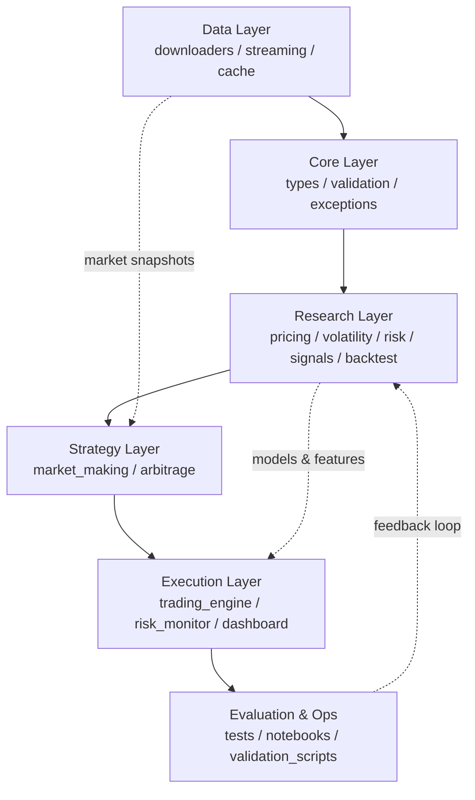
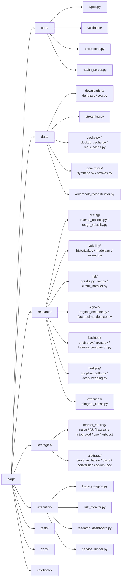
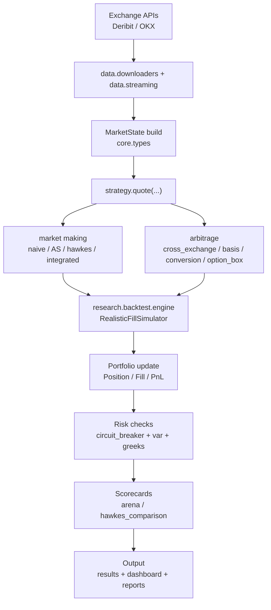
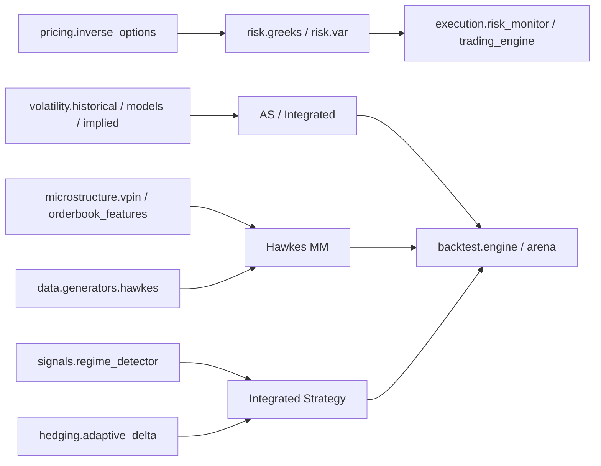
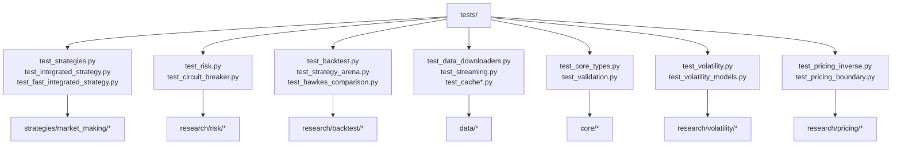
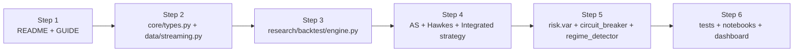

# 项目全景图（Mermaid 学习版）

> 目标：用一套 Mermaid 图帮助你从“整体 -> 模块 -> 调用链 -> 测试”快速建立项目心智模型。  
> 范围：`corp/` 下核心代码与主流程，不包含 `venv/`、临时缓存与归档文档。

---

## 1) 全局分层总览

---

## 2) 目录结构图（核心）

---

## 3) 交易与回测主调用链

---

## 4) 算法模块关系图

---

## 5) 测试覆盖映射

---

## 6) 学习顺序建议

