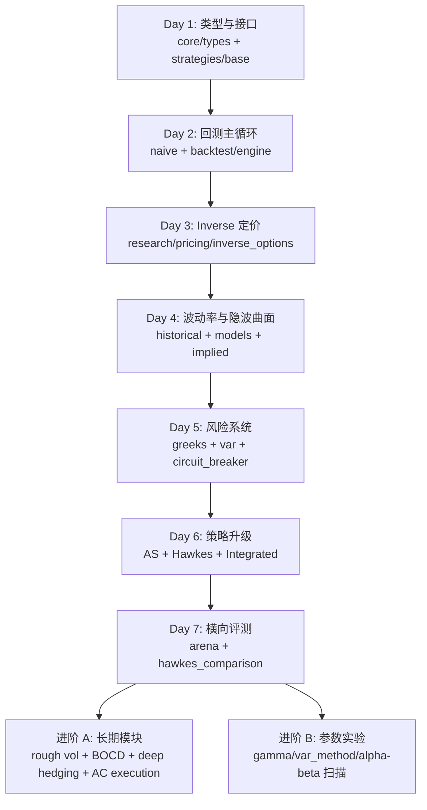

# CORP 算法与模型入门学习版（按初学者节奏）

> 这是一份“先跑通、再吃透”的学习手册。  
> 如果你暂时不想一上来就看 700 行深度文档，请从这里开始。

对应完整版：`<PROJECT_ROOT>/corp/docs/算法与模型深度讲解.md`

---

## 0. 你现在在学什么

这个项目本质是一个“加密期权研究工厂”：

1. 抓数据（Deribit/OKX）
2. 算模型（定价/波动率/风险）
3. 产策略（做市/套利/对冲）
4. 跑回测（看收益和风险）

你可以把它理解成：

- `research/` = 数学引擎
- `strategies/` = 决策大脑
- `backtest/` = 模拟交易场
- `data/` = 喂数据的系统

### 0.1 学习路线图（Mermaid）



---

## 1. 先记住 3 个核心概念

### 概念 A：币本位（inverse）和线性合约不一样

在这个项目里，很多计算默认是 inverse 语义（币本位）。

最重要的 PnL 形式是：

\[
PnL = size \cdot (1/P_{entry} - 1/P_{exit})
\]

对应代码：

- `<PROJECT_ROOT>/corp/research/pricing/inverse_options.py`
- `<PROJECT_ROOT>/corp/core/types.py`

### 概念 B：策略只做一件事

所有做市策略都实现同一个接口：

- 输入：`MarketState + Position`
- 输出：`QuoteAction`（bid/ask 价格和数量）

对应代码：

- `<PROJECT_ROOT>/corp/strategies/base.py`

### 概念 C：风控是硬约束，不是建议

即使策略想交易，`CircuitBreaker` 也可能禁止。

对应代码：

- `<PROJECT_ROOT>/corp/research/risk/circuit_breaker.py`

---

## 2. 初学者最小阅读清单（10 个文件）

按顺序读：

1. `<PROJECT_ROOT>/corp/core/types.py`
2. `<PROJECT_ROOT>/corp/strategies/base.py`
3. `<PROJECT_ROOT>/corp/strategies/market_making/naive.py`
4. `<PROJECT_ROOT>/corp/research/backtest/engine.py`
5. `<PROJECT_ROOT>/corp/research/pricing/inverse_options.py`
6. `<PROJECT_ROOT>/corp/research/volatility/historical.py`
7. `<PROJECT_ROOT>/corp/research/risk/var.py`
8. `<PROJECT_ROOT>/corp/research/risk/circuit_breaker.py`
9. `<PROJECT_ROOT>/corp/strategies/market_making/avellaneda_stoikov.py`
10. `<PROJECT_ROOT>/corp/strategies/market_making/integrated_strategy.py`

读完这 10 个文件，你就能理解项目 70% 的主干。

---

## 3. 一周学习节奏（推荐）

### Day 1：认识数据结构

目标：看懂系统里“数据长什么样”。

读：

- `core/types.py`
- `strategies/base.py`

完成标志：

- 你能说清楚 `MarketState` 里最重要的字段。
- 你能解释 `QuoteAction` 是策略和回测之间的协议。

### Day 2：跑通一条最小回测链路

目标：搞清楚策略如何被回测引擎调用。

读：

- `strategies/market_making/naive.py`
- `research/backtest/engine.py`

完成标志：

- 你能画出：`run -> quote -> fill -> process_fill -> result`。

### Day 3：学会 inverse 定价

目标：知道“币本位公式”为什么不同。

读：

- `research/pricing/inverse_options.py`

完成标志：

- 你能解释为何这里用 `ln(K/S)`。
- 你知道隐波求解是牛顿 + 二分 fallback。

### Day 4：学会波动率与隐波曲面

读：

- `research/volatility/historical.py`
- `research/volatility/models.py`
- `research/volatility/implied.py`

完成标志：

- 你知道历史波动率、条件波动率、隐含波动率分别在干什么。
- 你知道 `VolatilitySurface` 不只是插值，还做无套利检查。

### Day 5：学风险系统

读：

- `research/risk/greeks.py`
- `research/risk/var.py`
- `research/risk/circuit_breaker.py`

完成标志：

- 你能说出 VaR 的 3 种常见实现差异。
- 你知道 circuit breaker 四状态意味着什么。

### Day 6：学做市策略升级路径

读：

- `avellaneda_stoikov.py`
- `hawkes_mm.py`
- `integrated_strategy.py`

完成标志：

- 你能比较 Naive / AS / Hawkes / Integrated 的核心差别。

### Day 7：做横向比较

读：

- `research/backtest/arena.py`
- `research/backtest/hawkes_comparison.py`

完成标志：

- 你能设计一个“公平对比”的实验（相同数据、相同成本、相同初始资金）。

---

## 4. 三条最重要调用链（背下来）

### 链路 1：策略回测主链

```text
BacktestEngine.run()
  -> strategy.quote(...)
  -> fill_simulator.simulate_fill(...)
  -> _process_fill(...)
  -> _compute_result()
```

### 链路 2：集成策略风控链

```text
IntegratedStrategy.quote()
  -> circuit_breaker.check_risk_limits(...)
  -> regime_detector.update(...)
  -> hedger.should_hedge(...)
  -> 输出 QuoteAction
```

### 链路 3：隐波曲面链

```text
add_from_market_data()
  -> implied_volatility()
  -> fit_svi()
  -> get_volatility()
  -> validate_no_arbitrage()
```

---

## 5. 初学者 5 个动手练习（最有效）

1. 只改 `Naive` 的 `spread_bps`，比较 PnL 和成交数。
2. 在 AS 策略里扫 `gamma`，看回撤和库存波动变化。
3. 切换 VaR 方法（parametric/historical/evt），看熔断触发频率。
4. 在 Hawkes 策略里改 `alpha/beta`，观察价差和成交密度。
5. 用 `StrategyArena` 同时跑 3 个策略，做一次表格对比。

---

## 6. 常见卡点

### 卡点 1：为什么结果和预期相反？

先查：

- 是否 inverse 语义用错
- 是否被 circuit breaker 限制交易
- 是否成本（slippage/fee/adverse selection）吞掉了毛利润

### 卡点 2：先学策略还是先学模型？

初学者建议：

- 先回测链路 + 简单策略
- 再回头学定价和波动率

否则容易只会公式、不会定位代码行为。

### 卡点 3：模型太多看不过来

优先级：

1. inverse pricing
2. 历史波动率 + IV
3. VaR + circuit breaker
4. AS/Hawkes/Integrated
5. 长期模块（rough vol/BOCD/deep hedging/AC）

---

## 7. 下一步怎么从“看懂”到“会改”

当你读完本入门版后，建议立刻做两件事：

1. 选一个策略（建议 `Integrated`），画出你自己的调用时序图。
2. 选一个风险参数（例如 `daily_loss_limit_pct`），做一次敏感性实验并记录结论。

完成后再进入完整版：

`<PROJECT_ROOT>/corp/docs/算法与模型深度讲解.md`

你会明显更快吸收。
