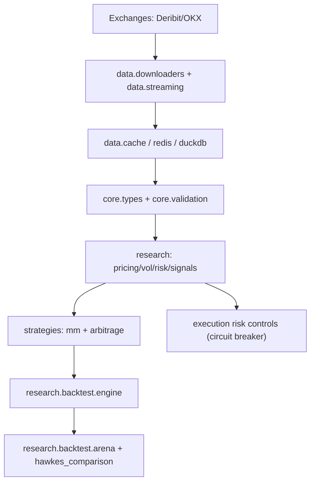

# CORP 算法与模型深度讲解

> 面向想“吃透理论 + 对照代码实现 + 理解整体工程结构”的读者。  
> 本文档以当前仓库代码为准，覆盖项目主干模型、策略、风险控制、回测框架与长期研究模块。

---

## 1. 项目目标与全局设计

CORP（Crypto Options Research Platform）聚焦**币本位期权研究与策略回测**，核心目标是把以下能力打通为一条闭环：

1. 多交易所数据获取与规范化
2. 研究模型（定价、波动率、风险、信号）
3. 策略生成（做市、套利、对冲、执行）
4. 事件驱动回测与横向比较
5. 风控治理与工程化运行

对应代码主干：

- `core/`: 类型系统、异常、验证、健康检查
- `data/`: 下载器、缓存、多层数据管理、流式处理
- `research/`: 定价/波动率/风险/信号/回测/对冲/执行研究
- `strategies/`: 做市与套利策略实现
- `execution/`: 运行时服务入口（容器化健康服务、研究看板）

### 1.1 架构层级



重点是：**研究层不是孤立数学库，而是被策略与回测直接消费**。

---

## 2. 核心数据模型（先读这一层）

核心类型在 `core/types.py`，几乎所有模块都依赖它。

关键数据类：

- `Tick`: 自动计算 `mid`、`spread`、`spread_bps`
- `OrderBook`: 提供 `best_bid`、`best_ask`、`mid_price`、`imbalance()`
- `Greeks`: `delta/gamma/theta/vega/rho/vanna/charm`
- `OptionContract`: 币本位标志 `inverse=True`、`time_to_expiry()`
- `Position`: 同时支持线性与 inverse 的 `unrealized_pnl()`
- `MarketState`: 策略输入载体（价格、盘口、成交、特征、可选 Greeks/IV）
- `QuoteAction`: 策略输出（bid/ask price + size + metadata）

策略统一接口在 `strategies/base.py`：

- `MarketMakingStrategy.quote(state, position)`
- `MarketMakingStrategy.on_fill(...)`
- `MarketMakingStrategy.reset()`

这保证了不同模型能被同一回测引擎公平比较。

---

## 3. 定价模型体系

### 3.1 币本位期权定价（InverseOptionPricer）

代码：`research/pricing/inverse_options.py`

这是项目最核心的金融数学模块。币本位期权 payoff 在 `1/S` 空间定义，定价与标准 BS 不同。

#### 3.1.1 d1/d2（inverse 形式）

\[
d_1 = \frac{\ln(K/S) + (r + 0.5\sigma^2)T}{\sigma\sqrt{T}},\quad d_2=d_1-\sigma\sqrt{T}
\]

与标准 BS 的差异是 `K/S` 而非 `S/K`。

#### 3.1.2 价格公式

- Call:
\[
C_{inv}=e^{-rT}\frac{1}{K}N(-d_2)-\frac{1}{S}N(-d_1)
\]

- Put:
\[
P_{inv}=\frac{1}{S}N(d_1)-e^{-rT}\frac{1}{K}N(d_2)
\]

对应实现：

- `InverseOptionPricer.calculate_price()`
- `InverseOptionPricer.calculate_price_and_greeks()`
- `InverseOptionPricer._calculate_greeks_from_d()`

#### 3.1.3 PnL 与平价

- inverse PnL:
\[
PnL = size \cdot (1/P_{entry} - 1/P_{exit})
\]

对应：`InverseOptionPricer.calculate_pnl()`

- Put-Call parity（inverse）检查：`inverse_option_parity()`

#### 3.1.4 数值求解细节

隐波求解支持牛顿 + 二分 fallback：

- `calculate_implied_volatility()`
- `_iv_bisection()`

关键工程点：

- 输入有效性约束（极端波动率/利率保护）
- T 接近 0 的边界处理
- Vega 尺度（每 1% 波动率）与迭代导数尺度一致性

### 3.2 粗糙波动率定价（长期研究模块）

代码：`research/pricing/rough_volatility.py`

`RoughVolatilityPricer` 是 rough Bergomi 风格的 Monte Carlo 实现，关键组件：

- Volterra kernel 权重：`_kernel_weights()`
- 相关布朗增量：`_draw_correlated_brownians()`
- 路径仿真：`simulate_paths()`
- 欧式期权定价：`price_european_option()`
- 置信区间：`price_with_confidence_interval()`

它更偏研究与实验，不直接替代生产策略定价核。

---

## 4. 波动率建模体系

### 4.1 历史波动率估计

代码：`research/volatility/historical.py`

已实现估计器：

- `realized_volatility`
- `parkinson_volatility`
- `garman_klass_volatility`
- `rogers_satchell_volatility`
- `yang_zhang_volatility`

工程特点：

- 年化周期参数可配置（crypto 24/7）
- 小样本修正（如 Parkinson 的无偏修正）
- 统一入口 `calculate_volatility_from_ohlc()`

### 4.2 条件波动率与状态模型

代码：`research/volatility/models.py`

主线模型：

- EWMA: `ewma_volatility`, `ewma_series`
- GARCH(1,1): `garch_volatility`, `estimate_garch_params`
- HAR-RV: `har_volatility`, `estimate_har_params`, `har_forecast`

扩展模型：

- `rough_volatility_signature`（Hurst 粗糙指数）
- `bipower_variation`, `medrv_volatility`, `two_scale_realized_volatility`, `realized_kernel_volatility`
- `egarch_volatility`, `gjr_garch_volatility`
- `hamilton_filter_regime_switching`, `volatility_regime_switching`

性能点：

- GARCH 递推和对数似然支持 numba 路径（若可用）

### 4.3 隐含波动率与曲面

代码：`research/volatility/implied.py`

模块组成：

- BS 价格与 Vega：`black_scholes_price`, `black_scholes_vega`
- IV 求解：`implied_volatility_bisection/newton/jaeckel/lbr`
- 曲面类：`VolatilitySurface`

`VolatilitySurface` 关键能力：

- `add_from_market_data()` 批量建点
- `fit_svi()` / `fit_all_svi()` 做 SVI 参数化
- `get_volatility(..., method="svi")` 插值/外推
- 无套利检查：
  - `check_butterfly_arbitrage()`
  - `check_calendar_arbitrage()`
  - `validate_no_arbitrage()`
  - `detect_arbitrage_opportunities()`

这使波动率模块不仅能“算 IV”，还能做结构化曲面质量控制。

---

## 5. 风险模型体系

### 5.1 Greeks 与组合暴露

代码：`research/risk/greeks.py`

主类：

- `BlackScholesGreeks`
- `GreeksRiskAnalyzer`
- `PortfolioGreeks`

关键机制：

- 自动识别币本位/线性合约并选用对应 Greeks 计算（inverse 走 `InverseOptionPricer`）
- 组合 Greeks 可按币种分组，避免直接把 BTC Delta 与 ETH Delta 硬相加
- 提供情景分析入口 `calculate_greeks_scenarios()`

### 5.2 VaR / CVaR / Stress

代码：`research/risk/var.py`

`VaRCalculator` 支持：

- `parametric_var`（方差-协方差）
- `cornish_fisher_var`（偏度峰度修正）
- `historical_var`
- `filtered_historical_var`（FHS）
- `evt_var`（POT/GPD 尾部）
- `monte_carlo_var`（可引入 Greeks 非线性）

另有 `StressTest` 预置场景：`market_crash`, `vol_spike`, `liquidity_crisis`, `flash_crash`。

### 5.3 熔断器（Circuit Breaker）

代码：`research/risk/circuit_breaker.py`

状态机：

- `NORMAL`
- `WARNING`
- `RESTRICTED`
- `HALTED`

主流程在 `CircuitBreaker.check_risk_limits()`，其内部做：

- 日损限制
- 回撤限制
- VaR 限制（可配置方法）
- 仓位集中度限制
- 可选单合约限额

对策略影响：

- `can_trade()` 决定动作是否允许
- `get_position_limit_multiplier()` 调整仓位上限
- `get_spread_multiplier()` 推高防御性价差

这部分在集成策略里是硬约束，而不是建议信号。

---

## 6. 信号与状态检测

### 6.1 HMM 波动率状态机

代码：`research/signals/regime_detector.py`

`VolatilityRegimeDetector` 用 `hmmlearn.GaussianHMM`，状态为 `LOW/MEDIUM/HIGH`。

特征来自：

- 当前 return
- 多窗口 realized vol（5/15/30）

关键工程做法：

- 训练前特征标准化
- 拟合后按波动水平重映射状态索引（解决 HMM 状态标签不稳定问题）
- 训练失败容错与退化路径

### 6.2 低延迟状态检测器

代码：`research/signals/fast_regime_detector.py`

`FastVolatilityRegimeDetector` 为生产低延迟版本：

- 阈值法始终可用（超快）
- HMM 异步训练
- HMM 推理超时自动降级
- 统计降级率/命中率

适合报价路径上的严格延迟预算。

### 6.3 在线贝叶斯变点检测（长期模块）

代码：`research/signals/bayesian_changepoint.py`

`OnlineBayesianChangepointDetector`（BOCD）核心：

- run-length posterior 递推
- Student-t 预测分布
- hazard rate 控制变点先验

用于检测 regime 断点，比固定窗口阈值更“事件驱动”。

---

## 7. 做市策略体系

### 7.1 基线：Naive

代码：`strategies/market_making/naive.py`

- 固定价差，围绕 mid 对称报价
- 仅做基本库存上限裁剪

作用：作为回测比较基线。

### 7.2 Avellaneda-Stoikov

代码：`strategies/market_making/avellaneda_stoikov.py`

核心公式已落在代码注释与实现中：

- reservation price:
\[
r = s - q\gamma\sigma^2(T-t)
\]

- spread 组件包含库存风险与成交风险项

实现细节：

- 真正使用市场时间戳计算 `T-t`
- 可选 bounded inventory（tanh 饱和）防止库存项发散
- `ASWithVolatilityAdaptation` 版本支持滚动波动率自适应

### 7.3 Hawkes 做市

代码：`strategies/market_making/hawkes_mm.py`

核心思想：用自激励点过程刻画订单流聚簇，动态调 spread/size。

组件：

- `HawkesIntensityMonitor`
- `HawkesMarketMaker`
- `AdaptiveHawkesMarketMaker`

关键逻辑：

- 强度高时窄价差，低时宽价差
- 买卖强度拆分用于方向不平衡检测
- 逆向选择检测触发防御性非对称加宽
- 自适应版本在线更新 `(mu, alpha, beta)`

### 7.4 综合策略（Integrated）

代码：

- `strategies/market_making/integrated_strategy.py`
- `strategies/market_making/fast_integrated_strategy.py`

标准版集成：

- Circuit Breaker
- Regime Detector
- Adaptive Delta Hedger
- 库存 skew 与动态 spread

Fast 版进一步优化：

- FastRegimeDetector
- Greeks LRU 缓存
- 风险检查节流（时间间隔 + 价格变动阈值）
- 报价延迟统计埋点

### 7.5 ML / RL 做市

- XGBoost 策略：`strategies/market_making/xgboost_spread.py`
  - `FeatureEngineer` 提取盘口与微观结构特征
  - 以“未来窗口成本最小化”生成监督标签（目标 spread）

- PPO 策略：`strategies/market_making/ppo_agent.py`
  - `MarketMakingEnv` 构建训练环境
  - `MarketMakingActorCritic` 支持 LSTM
  - `PPOMarketMaker` 在线推断，训练端执行 PPO 更新

注意：RL 环境是研究抽象，不等同于实盘撮合细节。

---

## 8. 套利策略体系

### 8.1 跨交易所套利

代码：`strategies/arbitrage/cross_exchange.py`

- 维护多交易所价格缓存
- 计算净利润时扣除手续费与滑点
- 支持执行仿真 `simulate_execution()`（含延迟惩罚）

### 8.2 期现基差套利

代码：`strategies/arbitrage/basis.py`

核心关系：
\[
F_{fair}=S\cdot e^{(r-q)T}
\]

模块支持：

- 动态 funding rate（EWMA）
- 正/负基差机会识别
- 保证金缓冲与风险约束

### 8.3 转换/反转套利

代码：`strategies/arbitrage/conversion.py`

基于平价偏离：
\[
C-P \overset{?}{=} S-Ke^{-rT}
\]

输出 `conversion` 或 `reversal` 方向，并考虑三腿交易成本。

### 8.4 盒式套利

代码：`strategies/arbitrage/option_box.py`

通过四腿期权构造确定性到期 payoff：

- payoff = \(K_{high}-K_{low}\)
- 比较净权利金与理论贴现值识别机会

支持扫描执行价对并附加流动性评分。

---

## 9. 对冲与执行（长期研究模块）

### 9.1 自适应 Delta 对冲

代码：`research/hedging/adaptive_delta.py`

`AdaptiveDeltaHedger` 的核心是“何时对冲 + 对冲多少”：

- 基础间隔 + 价格骤变加速
- Gamma 高时加速与缩步
- inverse 合约下考虑价格水平对对冲量的非线性放大

输出结构：`HedgeDecision`（含 urgency/reason/size）。

### 9.2 Deep Hedging

代码：`research/hedging/deep_hedging.py`

- `DeepHedgingPolicy`: MLP（有 sklearn）或 ridge 线性回退
- `DeepHedger`: 从路径数据构建监督数据集并训练 hedge policy
- 评估：`evaluate_hedging_error()`（含交易成本）

这是研究型可扩展入口，不直接替代风控层。

### 9.3 Almgren-Chriss 最优执行

代码：`research/execution/almgren_chriss.py`

`AlmgrenChrissExecutor` 提供：

- 最优库存轨迹 `optimal_inventory_path()`
- 子单计划 `optimal_trading_schedule()`
- 目标函数分解（临时冲击/永久冲击/风险惩罚）
- Monte Carlo 成本仿真与报告

可用于把“研究策略”进一步映射到“可执行切片”。

---

## 10. 回测与比较框架

### 10.1 事件驱动回测引擎

代码：`research/backtest/engine.py`

主流程 `BacktestEngine.run()`：

1. 重置策略/状态
2. 构造市场状态（订单簿、价格、时间）
3. 用上一拍 quote + 当前成交流仿真 fill
4. 处理成交更新持仓/现金
5. 策略产出新 quote
6. 记录 PnL 与风险轨迹

`RealisticFillSimulator` 关键摩擦：

- 延迟
- 深度滑点（VWAP + 随机项）
- 费用
- 逆向选择惩罚

结果对象 `BacktestResult` 包含：

- 总 PnL（crypto + USD）
- Sharpe / Deflated Sharpe / Drawdown
- 成交统计
- 成本分解
- 置信区间（bootstrap）

### 10.2 多策略竞技场

代码：`research/backtest/arena.py`

`StrategyArena` 保证公平对比：

- 同样数据
- 同样成本模型
- 同样初始资金

输出 `StrategyScorecard`，并做多策略 Sharpe 偏差修正。

### 10.3 Hawkes 专项评测

代码：`research/backtest/hawkes_comparison.py`

- `ScenarioGenerator` 生成聚簇强度不同的合成场景 + 压测场景
- `ComprehensiveHawkesComparison` 批量跑多场景
- `HawkesMetricsCollector` 统计强度相关专项指标

适合做“模型假设是否带来可观测 alpha”的专项验证。

---

## 11. 数据层与工程底座

### 11.1 下载与流式

- Deribit: `data/downloaders/deribit.py`
- OKX: `data/downloaders/okx.py`
- WebSocket: `data/streaming.py`

流式层支持：

- 自动重连与指数退避
- 订阅路由与回调
- 队列背压
- 订单簿增量重建

### 11.2 订单簿重建

代码：`data/orderbook_reconstructor.py`

- `OrderBookReconstructor` 基于 sequence 连续性重放增量
- gap 检测触发重同步
- 多合约统一管理 `MultiInstrumentReconstructor`

### 11.3 多层缓存

- Parquet: `data/cache.py`
- Redis/DuckDB 集成：`data/integrated_manager.py`
- TTL 策略：`data/cache_policy.py`

分层目标：

- 热路径读低延迟（Redis）
- 历史落盘可回放（Parquet）
- 分析查询高效（DuckDB）

### 11.4 验证与健康

- Pydantic schema：`core/validation/schemas.py`
- 业务校验函数：`core/validation/validators.py`
- 服务运行：`execution/service_runner.py`
- 研究看板：`execution/research_dashboard.py`

---

## 12. 关键调用链（代码阅读主线）

### 12.1 做市回测链

```text
BacktestEngine.run()
  -> strategy.quote(MarketState, Position)
  -> RealisticFillSimulator.simulate_fill(...)
  -> BacktestEngine._process_fill(...)
  -> strategy.on_fill(...)
  -> BacktestEngine._compute_result()
```

### 12.2 集成策略风控链

```text
IntegratedMarketMakingStrategy.quote()
  -> _update_portfolio_state()
  -> circuit_breaker.check_risk_limits(...)
  -> can_trade(...)
  -> regime_detector.update(...)
  -> hedger.should_hedge(...)
  -> _calculate_reservation_price(...)
  -> _calculate_quote_sizes(...)
```

### 12.3 波动率曲面链

```text
VolatilitySurface.add_from_market_data(...)
  -> implied_volatility(...)
  -> fit_svi()/fit_all_svi()
  -> get_volatility(...)
  -> validate_no_arbitrage()/detect_arbitrage_opportunities()
```

---

## 13. 学习路径（建议按这个顺序）

### Phase A: 先打地基（1-2 天）

1. `core/types.py`
2. `strategies/base.py`
3. `research/backtest/engine.py`

目标：理解“策略函数签名”和“回测事件循环”。

### Phase B: 数学内核（2-4 天）

1. `research/pricing/inverse_options.py`
2. `research/volatility/historical.py`
3. `research/volatility/models.py`
4. `research/volatility/implied.py`

目标：把币本位定价、波动率估计与 IV 曲面连起来。

### Phase C: 风险 + 信号（2-3 天）

1. `research/risk/greeks.py`
2. `research/risk/var.py`
3. `research/risk/circuit_breaker.py`
4. `research/signals/regime_detector.py`
5. `research/signals/fast_regime_detector.py`

目标：理解策略在“有风控约束的状态机”内如何运行。

### Phase D: 策略家族（3-5 天）

1. `strategies/market_making/naive.py`
2. `strategies/market_making/avellaneda_stoikov.py`
3. `strategies/market_making/hawkes_mm.py`
4. `strategies/market_making/integrated_strategy.py`
5. `strategies/arbitrage/*.py`

目标：完成从 baseline 到复杂策略的认知跃迁。

### Phase E: 长期模块（按需）

1. `research/pricing/rough_volatility.py`
2. `research/signals/bayesian_changepoint.py`
3. `research/hedging/deep_hedging.py`
4. `research/execution/almgren_chriss.py`

目标：理解项目的前沿扩展方向。

---

## 14. 建议动手实验（最能加深理解）

1. 只改 `ASConfig.gamma` 做参数扫描，观察 Sharpe/Drawdown 变化。
2. 固定策略，切换 `var_method`（parametric vs evt vs fhs）看熔断触发差异。
3. 在 Hawkes 策略中改变 `alpha/beta`，看 spread 与 fill 关系。
4. 对同一市场数据比较 `Integrated` 与 `FastIntegrated` 的延迟与收益差。
5. 使用 `VolatilitySurface.validate_no_arbitrage()` 清洗曲面后再驱动策略，对比稳定性。

---

## 15. 常见误区与纠偏

1. 把 inverse Greeks 当成线性合约 Greeks 直接使用。  
   纠偏：先确认 `OptionContract.inverse`，再走对应计算路径。

2. 只看收益不看执行摩擦。  
   纠偏：强制查看 `transaction_cost/slippage/adverse_selection_cost`。

3. 忽略状态机风控，误把“无交易”当策略失效。  
   纠偏：检查 `circuit_breaker` 状态迁移与触发日志。

4. 把 RL 训练结果直接等同实盘鲁棒性。  
   纠偏：先过严格回测、压力测试、漂移检验。

---

## 16. 一句话总结

这个项目的本质不是单一模型，而是一个**币本位期权研究操作系统**：

- 用严谨的 inverse 定价与波动率建模提供金融语义；
- 用风险状态机与多层回测把策略约束在可交易空间；
- 用可扩展的长期模块（rough vol / BOCD / deep hedging / optimal execution）持续向前演化。

如果你按本文的阅读路径从 `core/types.py` 一路走到 `integrated_strategy.py` 与 `backtest/engine.py`，再回头看各研究模块，理论和工程会自然闭环。
